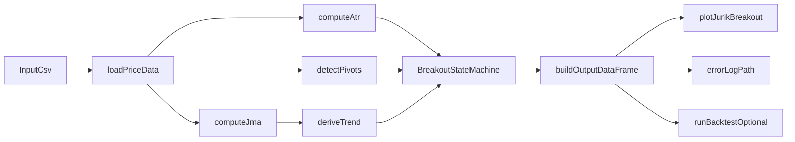

# Detailed Design Specification (DDS)

## Jurik Breakout Indicator System

## 1. Project Information

- Project Name: A_share - Jurik Breakout Indicator
- Author: Simon Liao
- Date: 2026-04-10
- Behavioral Reference: `doc/Jurik`

## 2. Purpose

This document converts the TradingView Pine indicator into a Python
design that can be implemented with `pandas` and tested deterministically.
It specifies data flow, state variables, module-level algorithms, output
schema, and failure behavior.

Implementation preference:

- Prefer `pandas_ta` as the first-choice implementation for Pine
  `ta.*`-style functions when its semantics match the TradingView
  reference.
- Fall back to custom implementations only for functions where
  `pandas_ta` cannot reproduce Pine timing or smoothing closely enough.

## 3. Architecture Overview



Design constraint:

- JMA, pivot consumption, structure formation, and breakout detection are
  evaluated in time order.
- Any use of `pandas_ta` must be validated against `doc/Jurik` and real
  regression samples before being treated as Pine-equivalent.

## 4. Data Contract

### 4.1 Required Input Columns

- `date`
- `open`
- `high`
- `low`
- `close`
- `volume`

### 4.2 Input Preconditions

- Rows must be sorted ascending by `date`.
- Each date must be unique.
- `open`, `high`, `low`, `close`, `volume` must be numeric.
- `high >= max(open, close, low)` and `low <= min(open, close, high)`
  should hold where validation is strict.

### 4.3 Failure Strategy

- Missing required columns: raise `ValueError`
- Empty input: raise `ValueError`
- Non-monotonic dates: raise `ValueError`
- Null `close`: raise `ValueError`

## 5. Module Design

### 5.1 Data Loader

Responsibility:

- Read CSV from `data/daily_price` or another supplied path.
- Convert `date` to pandas datetime.
- Sort and validate schema.

Pseudo-code:

```python
def load_price_data(path: str) -> pd.DataFrame:
    df = pd.read_csv(path)
    validate_required_columns(df)
    df["date"] = pd.to_datetime(df["date"])
    df = df.sort_values("date").reset_index(drop=True)
    validate_monotonic_dates(df)
    return df
```

### 5.2 Logging Support

Responsibility:

- Ensure the project-root `log/` directory exists.
- Generate an `error_log_path` for indicator runs.
- Capture runtime failures from loader, indicator, writer, and chart
  layers.

Pseudo-code:

```python
def get_error_log_path(log_dir: str | Path, indicator_name: str) -> Path:
    log_dir = Path(log_dir)
    log_dir.mkdir(parents=True, exist_ok=True)
    today = datetime.now().strftime("%Y%m%d")
    return log_dir / f"{indicator_name}_{today}_error.log"
```

Design rules:

- `log_dir` defaults to project-root `log/`.
- `error_log_path` must not point inside `data/` or `output/`.
- Logging is an operational concern and must not change indicator values.

### 5.3 JMA Module

Responsibility:

- Reproduce Pine function `JurikMA(src, length, phase)`.

Formula:

```python
beta = 0.45 * (length - 1) / (0.45 * (length - 1) + 2)
alpha = beta ** phase
jma[0] = close[0]
jma[i] = (1 - alpha) * close[i] + alpha * jma[i - 1]
```

Implementation notes:

- Use an iterative loop over bars.
- Avoid vectorization that obscures recursive dependencies.
- `length <= 0` is invalid.

### 5.4 Trend Module

Responsibility:

- Reproduce `trend = jSmooth >= jSmooth[3]`.

Pseudo-code:

```python
for i in range(len(df)):
    if i < 3:
        trend[i] = False
    else:
        trend[i] = jma[i] >= jma[i - 3]
```

Implementation note:

- Pine uses `barstate.isconfirmed`; for offline daily CSV processing, all
  rows are treated as confirmed bars.

### 5.5 Pivot Detection Module

Responsibility:

- Produce pivot-high and pivot-low confirmation events equivalent to
  `ta.pivothigh(pivotLen, pivotLen)` and `ta.pivotlow(pivotLen, pivotLen)`.
- Keep `pivot_len` as a fixed parameter by default; any adaptive pivot
  mode must be a separate opt-in extension.

Definitions:

- A pivot high confirmed on bar `i` refers to source bar
  `pivot_idx = i - pivot_len`.
- A pivot low confirmed on bar `i` refers to source bar
  `pivot_idx = i - pivot_len`.

Pseudo-code:

```python
for i in range(len(df)):
    if i < 2 * pivot_len:
        continue

    pivot_idx = i - pivot_len
    high_window = high.iloc[i - 2 * pivot_len : i + 1]
    low_window = low.iloc[i - 2 * pivot_len : i + 1]

    if high.iloc[pivot_idx] == high_window.max():
        ph[i] = high.iloc[pivot_idx]
        ph_idx[i] = pivot_idx

    if low.iloc[pivot_idx] == low_window.min():
        pl[i] = low.iloc[pivot_idx]
        pl_idx[i] = pivot_idx
```

Important semantic rule:

- The pivot price belongs to `pivot_idx`, but the state machine may only
  consume it at confirmation bar `i`.
- The center bar must be the unique high or low in the full window; tied
  extremes do not qualify as Pine-style pivots.
- If `pandas_ta` is evaluated for pivot support, it may only be adopted
  when it reproduces this delayed-confirmation behavior exactly.

### 5.6 ATR Module

Responsibility:

- Compute ATR for structure validation.

Formula:

```python
tr[i] = max(
    high[i] - low[i],
    abs(high[i] - close[i - 1]),
    abs(low[i] - close[i - 1]),
)
atr = tr.rolling(window=atr_window, min_periods=atr_window).mean()
```

Notes:

- `atr_window` defaults to `200`.
- Before the ATR window is filled, `atr` is `NaN`.
- A structure requiring ATR cannot be formed while ATR is `NaN`.
- Preferred implementation path is `pandas_ta.atr(...)`, provided its
  smoothing matches Pine `ta.atr(...)` in regression checks.

### 5.7 Breakout State Machine

Responsibility:

- Convert trend and confirmed pivots into structures and breakout
  signals.

State fields:

- `H: float | None`
- `Hi: int | None`
- `L: float | None`
- `Li: int | None`
- `BreakUp: int`
- `BreakDn: int`
- `upper_active: bool`
- `lower_active: bool`
- `res_line_value: float | None`
- `sup_line_value: float | None`
- `res_line_start_idx: int | None`
- `sup_line_start_idx: int | None`

#### 5.7.1 Upper Structure Logic

Creation conditions:

- `trend[i] is True`
- no active upper structure
- a pivot high is confirmed on bar `i`
- previous high pivot exists with index `Hi`
- `Hi > BreakUp`
- `abs(ph[i] - H) < atr[i]`

Actions on creation:

- activate upper structure
- `res_line_value = ph[i]`
- `res_line_start_idx = ph_idx[i]`
- store structure metadata for output

Actions on every bar while active:

- extend `res_line_end_idx = i`
- output `res_line = res_line_value`

Breakout condition:

- `close[i] > res_line_value`

Breakout actions:

- emit `signal = 1`
- set `breakout_up = True`
- `BreakUp = i`
- clear upper structure

Pivot tracking while in up-trend:

- if `ph[i]` exists, update `H = ph[i]` and `Hi = ph_idx[i]`

#### 5.7.2 Lower Structure Logic

Creation conditions:

- `trend[i] is False`
- no active lower structure
- a pivot low is confirmed on bar `i`
- previous low pivot exists with index `Li`
- `Li > BreakDn`
- `abs(pl[i] - L) < atr[i]`

Actions on creation:

- activate lower structure
- `sup_line_value = pl[i]`
- `sup_line_start_idx = pl_idx[i]`

Actions on every bar while active:

- extend `sup_line_end_idx = i`
- output `sup_line = sup_line_value`

Breakout condition:

- `close[i] < sup_line_value`

Breakout actions:

- emit `signal = -1`
- set `breakout_down = True`
- `BreakDn = i`
- clear lower structure

Pivot tracking while in down-trend:

- if `pl[i]` exists, update `L = pl[i]` and `Li = pl_idx[i]`

#### 5.7.3 Trend Flip Reset

If `trend[i] != trend[i - 1]`:

- clear active upper structure
- clear active lower structure
- do not clear `H`, `Hi`, `L`, `Li`
- keep `BreakUp` and `BreakDn` as last breakout guards

This preserves the Pine behavior where chart objects are deleted on
trend change.

### 5.8 Output Builder

Responsibility:

- Merge all core series and event fields into one DataFrame.

Required columns:

- `date, open, high, low, close, volume`
- `jma`
- `trend`
- `atr`
- `ph`, `pl`
- `ph_idx`, `pl_idx`
- `pivot_confirm`
- `pivot_type`
- `res_line`, `sup_line`
- `res_line_start_idx`, `res_line_end_idx`
- `sup_line_start_idx`, `sup_line_end_idx`
- `structure_active`
- `structure_side`
- `signal`
- `breakout_up`, `breakout_down`

Derived field rules:

- `pivot_confirm = bool(ph exists or pl exists)`
- `pivot_type in {"high", "low", None}`
- `structure_side in {"upper", "lower", None}`
- `signal in {-1, 0, 1}`

### 5.9 Visualization Module

Responsibility:

- Render Plotly layers only from the output DataFrame.

Input dependency:

- Must not call indicator logic directly.

### 5.10 Backtest Adapter

Responsibility:

- Optional future layer converting `signal` to entries and exits.

Status:

- Not required for first implementation because no backtest dependency is
  currently installed.

## 6. Sequential Processing Algorithm

Recommended top-level orchestration:

```python
def compute(df: pd.DataFrame, config: dict) -> pd.DataFrame:
    validate_input(df, config)
    jma = compute_jma(df["close"], config["len"], config["phase"])
    atr = compute_atr(df, config["atr_window"])
    pivots = detect_pivots(df, config["pivot_len"])
    trend = derive_trend(jma)
    state_rows = run_state_machine(df, jma, atr, pivots, trend, config)
    return assemble_output(df, jma, atr, pivots, trend, state_rows)
```

Execution ordering matters:

1. Compute recursive and rolling series.
2. Detect confirmed pivots.
3. Run row-wise state machine.
4. Build output.

## 7. Runtime Paths

Recommended runtime paths:

- input CSV: `data/daily_price/<symbol>_<YYYYMMDD>.csv`
- result CSV: `output/result_csv/<symbol>_jurik_breakout.csv`
- chart HTML: `output/charts/<symbol>_jurik_breakout.html`
- error log: `log/jurik_breakout_<YYYYMMDD>_error.log`

The indicator module should treat `log/` as the canonical root for
`error_log_path`.

## 8. Output Schema Details

| Column | Type | Meaning |
| --- | --- | --- |
| `jma` | float | Recursive Jurik MA approximation used by Pine |
| `trend` | bool | `True` for up-trend, `False` for down-trend |
| `atr` | float | ATR used for structure validation |
| `ph` | float or NaN | Confirmed pivot-high price on confirmation bar |
| `pl` | float or NaN | Confirmed pivot-low price on confirmation bar |
| `ph_idx` | int or NaN | Source index of the pivot-high bar |
| `pl_idx` | int or NaN | Source index of the pivot-low bar |
| `res_line` | float or NaN | Active upper breakout threshold |
| `sup_line` | float or NaN | Active lower breakout threshold |
| `signal` | int | `1`, `0`, `-1` |
| `pivot_confirm` | bool | Whether any pivot becomes visible on this bar |

## 9. Risks and Limitations

- Pivot detection is inherently lagging by `pivot_len` bars.
- ATR sensitivity can block or over-allow structure creation.
- Runtime exceptions should be captured in `error_log_path`, but logging
  should never be used as a substitute for raising validation errors in
  library code.
- The Pine script draws both a horizontal and a connecting line; the
  first Python implementation stores the breakout threshold as data and
  may omit the secondary connector line.
- Real-market breakout counts may differ from visual intuition because
  the script is strict about trend state and last breakout guards.

## 10. Future Enhancements

- Add YAML config loader
- Add batch mode over `Portfolio_shares.json`
- Add golden-snapshot regression fixtures
- Add optional backtest adapter once dependency choices are settled
