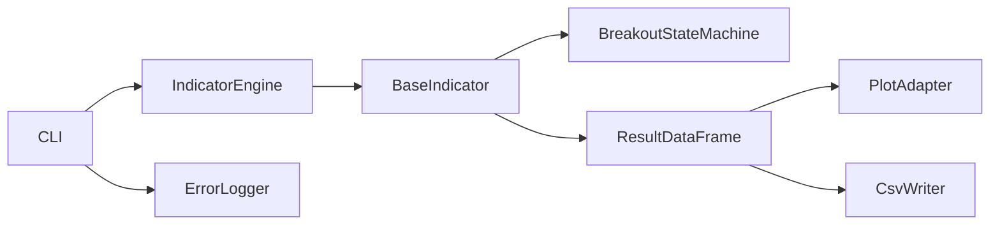

# Detailed Design Specification (DDS)

## Jurik Breakout Indicator System (Interface & CLI Focus)

## 1. Purpose

This document defines the Python interfaces required to implement the
Jurik Breakout indicator in a reusable way. It focuses on class and
function contracts, configuration rules, CLI behavior, and output
stability.

## 2. Interface Design Goals

- Keep indicator execution independent from chart rendering.
- Make input validation explicit and early.
- Use a uniform `DataFrame in -> DataFrame out` contract for indicators.
- Allow future registration of additional indicators without changing the
  CLI surface.
- Prefer existing `pandas_ta` functions for Pine `ta.*` equivalents when
  they match TradingView semantics closely enough.
- Allow custom replacements only where `pandas_ta` cannot reproduce Pine
  timing, state, or smoothing behavior accurately.

## 3. Core Architecture



## 4. Core Interfaces

### 4.1 BaseIndicator

Contract:

- Accept validated configuration at construction time.
- Accept a price DataFrame in `compute`.
- Return a new DataFrame with source columns preserved and derived
  columns appended.

```python
class BaseIndicator:
    def __init__(self, config: dict):
        self.config = config

    def validate_config(self) -> None:
        raise NotImplementedError

    def compute(self, df: "pd.DataFrame") -> "pd.DataFrame":
        raise NotImplementedError
```

Validation requirements:

- `config` must be a dictionary.
- Derived classes must raise `ValueError` on invalid parameters.

### 4.2 JurikBreakoutIndicator

Responsibilities:

- Validate OHLCV schema.
- Compute JMA, ATR, pivots, trend, and breakout state transitions.
- Reuse `pandas_ta` for ATR and other Pine-like helpers whenever
  regression checks confirm equivalent behavior.
- Return a DataFrame with a stable output schema.

```python
class JurikBreakoutIndicator(BaseIndicator):
    DEFAULT_CONFIG = {
        "len": 9,
        "phase": 0.15,
        "pivot_len": 4,
        "atr_window": 200,
    }

    def validate_config(self) -> None:
        """
        Rules:
            len > 0
            phase > 0
            pivot_len >= 1
            atr_window >= 1
        """

    def compute(self, df: "pd.DataFrame") -> "pd.DataFrame":
        """
        Required input columns:
            date, open, high, low, close, volume

        Guaranteed output columns:
            jma
            trend
            atr
            ph, pl
            ph_idx, pl_idx
            res_line, sup_line
            res_line_start_idx, res_line_end_idx
            sup_line_start_idx, sup_line_end_idx
            structure_active
            structure_side
            signal
            pivot_confirm
            pivot_type
            breakout_up
            breakout_down
        """
```

Input requirements:

- `df` must be sorted by ascending `date`.
- `date` should be parseable as timestamp values.
- `close` must not contain nulls.

Error handling:

- Raise `ValueError` for schema or ordering issues.
- Raise `ValueError` for invalid configuration.

### 4.3 BreakoutStateMachine

Responsibilities:

- Consume one confirmed bar at a time.
- Preserve internal breakout and structure state between rows.
- Emit row-level fields used to build the output DataFrame.

```python
class BreakoutStateMachine:
    def __init__(self, pivot_len: int):
        self.pivot_len = pivot_len
        self.reset()

    def reset(self) -> None:
        """
        Clears active structures and tracked state.
        """

    def update(self, idx: int, row: dict) -> dict:
        """
        Parameters:
            idx: current row index in ascending time order
            row: dictionary-like object containing:
                close
                trend
                atr
                ph, pl
                ph_idx, pl_idx

        Returns:
            {
                "res_line": float | None,
                "sup_line": float | None,
                "res_line_start_idx": int | None,
                "res_line_end_idx": int | None,
                "sup_line_start_idx": int | None,
                "sup_line_end_idx": int | None,
                "structure_active": bool,
                "structure_side": str | None,
                "signal": int,
                "pivot_confirm": bool,
                "pivot_type": str | None,
                "breakout_up": bool,
                "breakout_down": bool,
            }
        """
```

State machine invariants:

- Must be called in strictly ascending index order.
- `signal` must be one of `-1`, `0`, `1`.
- Only one side of structure can be active at a time.
- Trend flip clears active structures.

### 4.4 IndicatorEngine

Responsibilities:

- Register indicator classes by name.
- Instantiate them with config.
- Run them against a provided DataFrame.

```python
class IndicatorEngine:
    def __init__(self):
        self._registry = {}

    def register(self, name: str, indicator_cls) -> None:
        """
        Registers a BaseIndicator subclass under a unique name.
        """

    def run(self, name: str, df: "pd.DataFrame", config: dict | None = None) -> "pd.DataFrame":
        """
        Resolves the indicator, merges default config, and returns output DataFrame.
        """
```

Error handling:

- Unknown indicator name: raise `KeyError`
- Duplicate registration: raise `ValueError`

## 5. Supporting Function Interfaces

### 5.1 Loader

```python
def load_price_data(path: str) -> pd.DataFrame:
    """
    Read a CSV file with columns:
        date, open, high, low, close, volume
    Return a DataFrame sorted by ascending date.
    Raise ValueError on missing columns or invalid ordering.
    """
```

### 5.2 Visualization

```python
def plot_jurik_breakout(
    df: pd.DataFrame,
    output_file: str,
    show: bool = False,
) -> None:
    """
    Render an HTML chart using output columns already computed by the indicator.
    """
```

### 5.3 Output Naming

```python
def generate_output_filename(symbol: str, indicator: str) -> str:
    """
    Example:
        中国中铁_jurik_breakout_result.csv
    """
```

### 5.4 Error Log Path

```python
def get_error_log_path(
    indicator_name: str,
    log_dir: str = "log",
) -> Path:
    """
    Return a file path under the project-root `log/` directory.

    Example:
        log/jurik_breakout_20260410_error.log
    """
```

Contract:

- `log_dir` defaults to the root-level `log/` directory.
- The function must create `log/` when it does not exist.
- The returned `error_log_path` is used by CLI execution and batch runs.

### 5.5 Optional Backtest Adapter

```python
def run_backtest(df: pd.DataFrame, freq: str = "1D"):
    """
    Optional future extension.
    Consumes signal column and returns summary metrics.
    """
```

## 6. CLI Design

### 6.1 Recommended Command

Single-file mode is the primary target because it matches the current
repository shape.

```bash
python run_indicator.py \
  --indicator jurik_breakout \
  --input data/daily_price/中国中铁_20260410.csv \
  --output output/中国中铁_jurik_breakout.csv \
  --chart output/中国中铁_jurik_breakout.html \
  --log-dir log \
  --config config.yaml
```

### 6.2 Optional Future Command

Portfolio mode can be added after the single-file path is stable.

```bash
python run_indicator.py \
  --indicator jurik_breakout \
  --portfolio default \
  --data-dir data/daily_price \
  --output-dir output/
```

### 6.3 Argument Schema

```python
def parse_args():
    return {
        "indicator": str,
        "input": str | None,
        "output": str | None,
        "chart": str | None,
        "log_dir": str | None,
        "config": str | None,
        "portfolio": str | None,
        "data_dir": str | None,
        "show_chart": bool,
        "backtest": bool,
    }
```

CLI rules:

- `--indicator` is required.
- Either `--input` or `--portfolio` may be supplied, but not both in the
  first implementation unless explicitly supported.
- `--chart` is optional.
- `--log-dir` defaults to project-root `log/`.
- `--backtest` is optional and should fail gracefully when no backtest
  adapter is installed.
- Any CLI execution failure should be written to `error_log_path`.

## 7. Data Contract

Required input columns:

```python
["date", "open", "high", "low", "close", "volume"]
```

Required output columns:

```python
[
    "jma",
    "trend",
    "atr",
    "ph",
    "pl",
    "ph_idx",
    "pl_idx",
    "res_line",
    "sup_line",
    "signal",
    "pivot_confirm",
    "pivot_type",
    "structure_active",
    "structure_side",
    "breakout_up",
    "breakout_down",
]
```

Output guarantees:

- Preserve all original OHLCV columns.
- Preserve row count and row order.
- Use `NaN` or `None` for unavailable derived values during warm-up.
- Do not mutate the caller's input DataFrame in place.

## 8. YAML Configuration

Suggested config file:

```yaml
indicator: jurik_breakout

params:
  len: 9
  phase: 0.15
  pivot_len: 4
  atr_window: 200
```

Validation rules:

- `indicator` must match a registered engine name.
- `params.len > 0`
- `params.phase > 0`
- `params.pivot_len >= 1`
- `params.atr_window >= 1`
- `params.pivot_len` is fixed-mode by default for TradingView parity.
- Any future adaptive pivot mode must be opt-in and must not change the
  fixed baseline behavior used by regression tests.

## 9. Compatibility With Current Repository

The current repository already stores daily CSV data in
`data/daily_price` and documents the same OHLCV schema in
`datafetch.md`. The interface design should therefore:

- reuse the existing CSV format directly
- reuse the root-level `log/` directory for runtime failures
- prefer file-path based execution over package installation assumptions
- keep batch portfolio execution as a later extension

## 10. Extensibility

Reusable:

- CLI wrapper
- Data loader
- Visualization layer
- Engine registry

Replaceable:

- Indicator-specific compute logic
- State machine logic
- Backtest adapter
