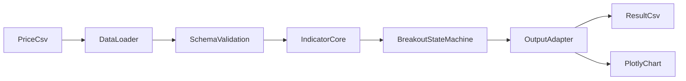

# Jurik Breakout Indicator - Software Design Document (SDD)

## 1. Purpose

This document defines a Python re-implementation of the TradingView
indicator `Jurik MA Trend Breakouts` stored in `doc/Jurik`. The design
goal is behaviorally equivalent signal generation, not a pixel-perfect
reproduction of TradingView drawing objects.

The first implementation scope is:

- Reproduce the indicator calculations and breakout timing.
- Read A-share daily OHLCV CSV files from `data/daily_price`.
- Export a result DataFrame or CSV with all intermediate columns needed
  for validation.
- Support optional HTML visualization.
- Write runtime error logs under the project-root `log/` directory.
- Be structured for later extension to batch runs and backtesting.

Out of scope for the first delivery:

- Real-time streaming bars
- Multi-timeframe logic
- Mandatory `vectorbt` integration
- TradingVue-specific rendering

## 2. Behavioral Baseline

`doc/Jurik` is the single source of truth for indicator behavior. The
following Pine semantics must be preserved in Python:

- `jSmooth = JurikMA(close, len, phase)`
- `trend = jSmooth >= jSmooth[3]` on confirmed bars
- `ph = ta.pivothigh(pivotLen, pivotLen)`
- `pl = ta.pivotlow(pivotLen, pivotLen)`
- `atr = ta.atr(200)`
- Upper structure is created only in up-trend.
- Lower structure is created only in down-trend.
- A valid structure requires two pivots whose price distance is smaller
  than ATR at confirmation time.
- Breakout occurs only after a structure exists and only on confirmed
  bars.
- Any active structure is cleared when trend flips.

## 3. Design Principles

- Preserve time-series causality. No column may use future information
  earlier than the Pine version exposes it.
- Prefer existing `pandas_ta` indicators for Pine-style `ta.*`
  calculations when their semantics match the TradingView reference.
- When `pandas_ta` behavior does not match Pine closely enough, document
  the gap explicitly and use a custom implementation only for that
  specific function.
- Keep Pine chart objects as data semantics. `line` and `label` become
  explicit columns and events.
- Favor readable, testable state transitions over aggressive
  vectorization.
- Expose all intermediate values needed for debugging and regression
  tests.

## 4. System Architecture



The architecture contains six logical layers:

### 4.1 Data Loader

Responsibilities:

- Read CSV with columns `date, open, high, low, close, volume`.
- Parse `date` and sort ascending.
- Reject missing required columns and non-numeric OHLC values.

### 4.2 Preprocessing

Responsibilities:

- Normalize dtypes.
- Remove duplicate dates or raise an input validation error.
- Guarantee index order used by sequential indicator execution.

### 4.3 Indicator Core

Responsibilities:

- Compute JMA recursively.
- Compute ATR using the configured ATR window, preferring `pandas_ta`
  when it matches Pine semantics.
- Generate pivot-high and pivot-low candidate series with delayed
  confirmation, reusing `pandas_ta` only if the confirmation timing is
  equivalent to TradingView Pine.
- Derive the trend boolean from JMA and its 3-bar lag.

### 4.4 Breakout State Machine

Responsibilities:

- Persist the last valid pivot references.
- Create upper and lower structures from pivot pairs.
- Extend active support or resistance levels over subsequent bars.
- Emit breakout signals and clear structures after breakout or trend
  change.

### 4.5 Output Adapter

Responsibilities:

- Join source OHLCV with derived columns.
- Express TradingView chart objects as tabular fields.
- Produce a stable CSV schema for regression tests and downstream use.

### 4.6 Visualization

Responsibilities:

- Plot candlesticks, JMA, active support and resistance lines, pivot
  confirmations, and breakout markers.
- Use output columns only; charting code must not recompute indicator
  logic.

### 4.7 Logging

Responsibilities:

- Create the project-root `log/` directory when missing.
- Expose a stable `error_log_path` for CLI and batch execution.
- Record input path, indicator name, configuration, and exception detail
  when execution fails.
- Keep logging separate from indicator calculations.

## 5. Module Responsibilities

### 5.1 JMA Module

Input:

- `close`
- `len`
- `phase`

Logic:

- `beta = 0.45 * (len - 1) / (0.45 * (len - 1) + 2)`
- `alpha = beta ** phase`
- `jma[i] = (1 - alpha) * close[i] + alpha * jma[i - 1]`

Notes:

- First value initializes from the first source close.
- This is a recursive series and should be implemented row by row.

### 5.2 Trend Module

Input:

- `jma`

Logic:

- `trend[i] = True` when `jma[i] >= jma[i - 3]`
- For bars where `i < 3`, `trend` is undefined or defaults to
  `False` until enough history exists.

### 5.3 Pivot Module

Input:

- `high`, `low`
- `pivot_len`

Parameter rule:

- `pivot_len` is a fixed configuration parameter by default to preserve
  TradingView equivalence.
- An adaptive pivot length may be added later as an optional extension,
  but it must not replace the fixed-mode baseline.

Logic:

- `ph` is confirmed at bar `i` when bar `i - pivot_len` is the maximum
  within `[i - 2 * pivot_len, i]`.
- `pl` is confirmed at bar `i` when bar `i - pivot_len` is the minimum
  within `[i - 2 * pivot_len, i]`.
- The center bar must be the unique extreme within the full window; tied
  highs or lows do not produce a pivot.

Important semantic rule:

- The pivot belongs to bar `i - pivot_len`, but it only becomes visible
  to the algorithm at bar `i`.

### 5.4 ATR Module

Input:

- `high`, `low`, `close`
- `atr_window`

Logic:

- Use standard true range:
  `max(high-low, abs(high-prev_close), abs(low-prev_close))`
- ATR is the rolling average of true range.

Default:

- `atr_window = 200` to match Pine.
- Preferred implementation path is `pandas_ta.atr(...)` when its output
  matches Pine `ta.atr(...)` on regression samples.

### 5.5 Breakout State Machine

State variables:

- `H`, `Hi`: latest confirmed pivot high price and source index
- `L`, `Li`: latest confirmed pivot low price and source index
- `BreakUp`, `BreakDn`: last breakout bar indices
- `upper_active`, `lower_active`
- `res_line_value`, `sup_line_value`
- `res_anchor_idx`, `sup_anchor_idx`

Rules:

- Up-trend only tracks and forms upper resistance structures.
- Down-trend only tracks and forms lower support structures.
- A structure is created only when the new pivot and stored pivot differ
  by less than ATR.
- Trend flip clears active structures immediately.
- Breakout above resistance emits `signal = 1`.
- Breakout below support emits `signal = -1`.
- All other bars emit `signal = 0`.

## 6. Output Schema

The result table should contain at least the following columns:

- `date, open, high, low, close, volume`
- `jma`
- `trend`
- `atr`
- `ph`, `pl`
- `ph_idx`, `pl_idx`
- `pivot_confirm`
- `pivot_type`
- `structure_active`
- `structure_side`
- `res_line`
- `sup_line`
- `res_line_start_idx`, `res_line_end_idx`
- `sup_line_start_idx`, `sup_line_end_idx`
- `signal`
- `breakout_up`
- `breakout_down`

Column semantics:

- `ph` and `pl` are emitted only on the bar where the pivot becomes
  confirmed.
- `pivot_confirm` is `True` only on bars where a pivot is confirmed.
- `res_line` and `sup_line` hold the currently active horizontal
  breakout threshold for that bar.
- `structure_active` marks whether any breakout structure is currently
  valid.

## 7. Boundary Conditions

- Minimum bars for any pivot signal: `2 * pivot_len + 1`
- Minimum bars for trend evaluation: `4`
- Minimum bars for stable ATR: `atr_window`
- Warm-up period rows may contain `NaN` in `atr`, `ph`, `pl`,
  `res_line`, and `sup_line`.
- Input with unsorted dates must be sorted before processing or rejected
  by validation.
- Missing `close` values must raise validation errors because JMA and ATR
  cannot be evaluated safely.

## 8. CLI and Execution Model

Recommended first-step CLI:

```bash
python run_indicator.py \
  --indicator jurik_breakout \
  --input data/daily_price/中国中铁_20260410.csv \
  --output output/中国中铁_jurik_breakout.csv \
  --chart output/中国中铁_jurik_breakout.html
```

Execution flow:

1. Load one CSV file.
2. Validate schema and ordering.
3. Run indicator computation sequentially.
4. Write result CSV.
5. Optionally render an HTML chart.
6. Write failures to `log/` through `error_log_path`.

Portfolio batch mode is a future extension and should reuse the same
single-file indicator runner.

## 9. Project Layout

Recommended repository layout after adding indicator support:

```text
A_share/
├── data/
│   └── daily_price/
├── doc/
│   └── Jurik
├── log/
│   └── jurik_breakout_<YYYYMMDD>_error.log
├── output/
│   ├── result_csv/
│   └── charts/
├── portfolio/
│   └── Portfolio_shares.json
├── src/
│   ├── data_fetch/
│   ├── indicators/
│   ├── state_machine/
│   ├── analytics/
│   ├── io/
│   ├── visualization/
│   └── run_indicator.py
├── tests/
│   ├── unit/
│   ├── component/
│   ├── integration/
│   └── regression/
├── Jurik_breakout_SDD.md
├── Jurik_Breakout_DDS.md
├── Jurik_Breakout_DDS_Interface.md
├── Jurik_Breakout_Test_Cases.md
├── datafetch.md
└── requirements.txt
```

Directory conventions:

- `log/` is the project-root runtime log directory.
- `error_log_path` must always resolve under `log/`.
- `output/result_csv/` stores indicator result CSV files.
- `output/charts/` stores Plotly HTML files.

## 10. Visualization Requirements

Plotly output should include:

- Candlestick series
- JMA line
- Active resistance line
- Active support line
- Pivot confirmation markers
- Up-breakout and down-breakout markers

Visualization must be a pure presentation layer. It should not make any
new trading decisions.

## 11. Testability Requirements

The design must support deterministic testing:

- Every derived field is available as a DataFrame column.
- No logic depends on plotting objects.
- Runtime failures can be inspected through files under `log/`.
- The state machine processes rows in ascending order only.
- Integration tests can use existing files in `data/daily_price`.
- Edge-condition tests can use small synthetic CSV fixtures.

## 12. Extensibility

Reusable components:

- CSV loader
- Validation layer
- CLI shell
- Visualization adapter

Replaceable components:

- Indicator core
- State machine
- Output column mapping

This allows later support for indicators such as MACD or RSI without
rewriting the loader, output, or chart pipeline.

## 13. Future Extensions

- Batch execution over all files in `data/daily_price`
- YAML configuration
- Optional `vectorbt` backtesting
- TradingVue-oriented frontend integration
